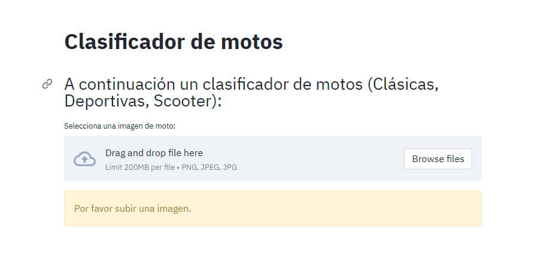
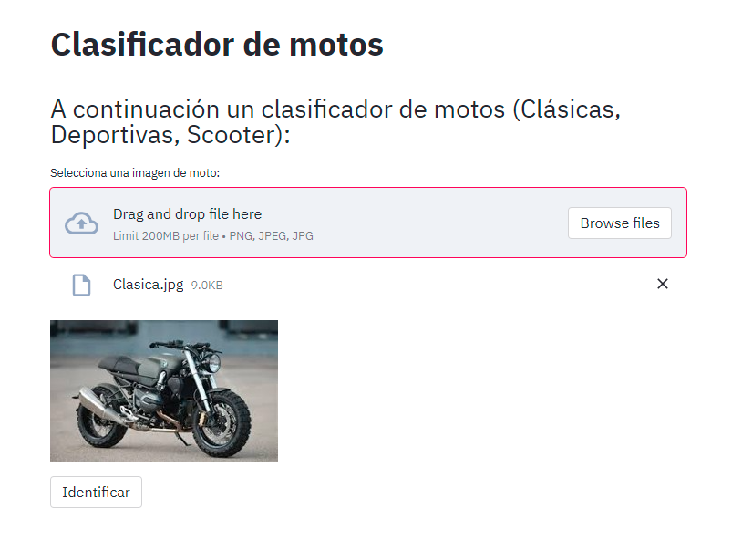
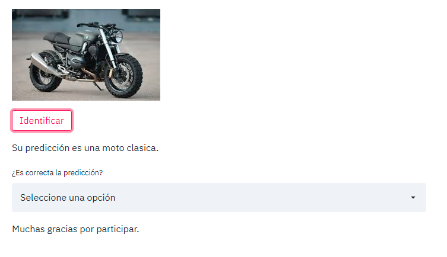

---

# Clasificador de motos

Utilizando una arquitectura Xception se desarrolló un clasificador de motos.

Se creó una plataforma que permite cargar imágenes clasificarlas en 9 clases diferentes,
Calle, Chopper, Cross, Cuatriciclos, Deportivas, Enduro, Naked, Scooters y Touring.
La plataforma tiene un sistema de feedback que permite al usuario verificar si la 
imagen fue clasificada correctamente y las guarda en background para reentrenar el sistema
posteriormente.

---

## Construcción del proyecto

Para este proyecto se utilizaron las siguientes herramientas:

* [Scrapy](https://scrapy.org/) - Framework para extracción de datos.
* [Streamlit](https://streamlit.io/) - Framework web usado.
* [Tensorflow](https://www.tensorflow.org/) - Librería para desarrollar modelos de ML.

---

## Instalación

Clona el proyecto:

```
git clone https://github.com/argenis-gomez/Clasificador-de-motos.git
```

Para iniciar es necesario instalar las dependencias de la siguiente forma:

```
pip install -r requirements.txt
```

Si deseas extraer nuevamente los datos para reentrenar el sistema:

```
scrapy runspider get_links.py -o Links.csv
python download_images.py
```


Al finalizar la instalación ejecutamos la aplicación con el siguiente comando:

```
streamlit run main.py
```

_Luego de iniciada la plataforma podrás clasificar imágenes de motos._

---

## Probar la plataforma

Al iniciar la plataforma observarás la siguiente imagen donde podrás cargan la imagen 
que desees predecir.



Luego de seleccionar la imagen que deseas clasificar podrás presionar en el botón de 
identificar e iniciará el proceso de clasificación.



Luego de clasificar la imagen, podrás dar un feedback del resultado obtenido.



_Repitiendo este proceso, podrá clasificar todas las imágenes que desee._

---

## Comentarios finales

* Actualmente el clasificador solo funciona con 9 clases de motos (Calle, Chopper, Cross, Cuatriciclos, Deportivas,
  Enduro, Naked, Scooters y Touring).
  
* Es necesario reiniciar la plataforma al culminar el proceso de clasificación y feedback.

* El modelo principal tiene una precisión del 88% en imágenes nuevas.

---

## Autor

* **Argenis Gómez** - *Desarrollo del proyecto* - Github: [argenis-gomez](https://github.com/argenis-gomez)

---
